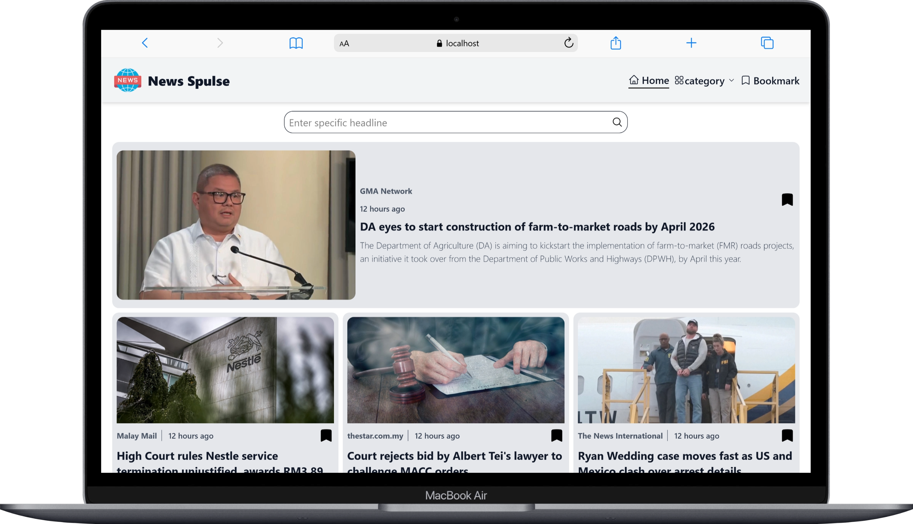
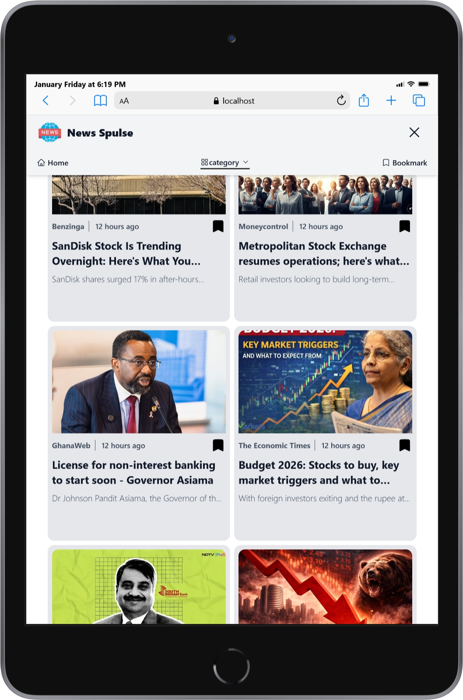
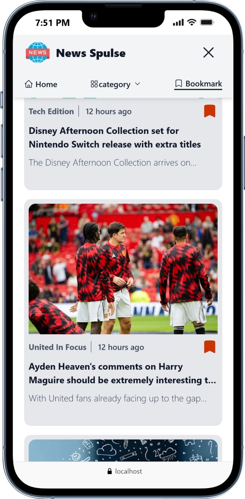
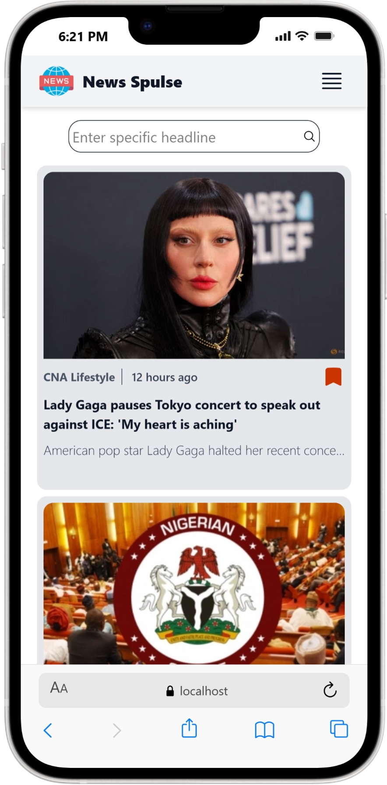

# News Spulse 

A modern **React News Application** that allows users to browse the latest news, explore categories, search for specific headlines, and bookmark favorite articles. The app is built with **React**, **React Router**, **React Query**, **Tailwind CSS**, and integrates with the **GNews API**.

---


## Live Features Overview

- Browse top headlines by category
- Search for specific news articles
- View detailed news in a modal overlay
- Bookmark news using Local Storage
- Responsive navigation bar (mobile & desktop)
- Loading and error handling states

---

## Tech Stack

- **React** (Functional Components + Hooks)
- **React Router DOM** (Routing & Layouts)
- **@tanstack/react-query** (Data fetching & caching)
- **Axios** (HTTP requests)
- **Tailwind CSS** (Styling)
- **LocalStorage** (Bookmarks persistence)
- **GNews API** (News data source)

---

## Project Structure

```
src/
│
├── components/
│   ├── Loader.jsx
│   ├── NavBar.jsx
│   ├── NewsCard.jsx
│   └── OpenSpecificNewsDetails.jsx
│
├── contextes/
│   ├── BookMarkContext.jsx
│   └── SelectedNewsContext.jsx
│
├── hookes/
│   └── useGetData.js
│
├── layouts/
│   └── MainLayout.jsx
│
├── pages/
│   ├── Home.jsx
│   ├── Category.jsx
│   ├── Search.jsx
│   ├── Bookmark.jsx
│   └── NotFound.jsx
│
├── Services/
│   ├── fichNewsDataApi.js
│   ├── BookmarkServices.js
│   └── timeFormat.js
│
└── assets/
    ├── logo.png
    └── placeholder.jpg
```

---

## Application Flow (Step by Step)

### 1- Data Fetching (Services + Hooks)

- **fichNewsDataApi.js**
  - `getDataByCategory(category)` → Fetches top headlines by category.
  - `searchForSpecificCategory(value)` → Searches news by keyword.

- **useGetData Hook**
  - Decides which API function to call (category or search).
  - Uses `react-query` for:
    - Caching
    - Loading states
    - Error handling
    - Auto refetch prevention

---

### 2- Global State Management (Context API)

#### SelectedNewsContext

- Stores the currently selected news article.
- Used to:
  - Open article details in a modal.
  - Close the modal globally.

#### BookMarkContext

- Manages bookmarked articles.
- Initial state is loaded from `localStorage`.
- Shared across the entire app.

---

### 3- Layout & Routing

#### MainLayout

- Wraps all pages.
- Contains:
  - `NavBar`
  - `Outlet` for nested routes
  - Conditional rendering of `OpenSpecificNewsDetails` modal

---

### 4- UI Components

#### Loader

- Simple animated spinner.
- Displayed during API loading states.

####  NavBar

- Responsive navigation bar.
- Features:
  - Home navigation
  - Category selector
  - Bookmark page link
  - Mobile menu toggle

#### NewsCard

- Reusable component for displaying news articles.
- Supports:
  - Header style (featured news)
  - Normal grid style
- Includes:
  - Source
  - Time ago formatting
  - Bookmark toggle

####  OpenSpecificNewsDetails

- Full-screen modal overlay.
- Displays:
  - Full article image
  - Description
  - Source
  - Published time
  - External article link

---

### 5- Pages Logic

#### Home

- Fetches **general** news.
- Displays:
  - Search bar
  - Featured article
  - News grid

#### Category

- Fetches news based on URL category param.
- Displays:
  - Featured article
  - Grid of remaining articles

####  Search

- Fetches news based on search keyword.
- Handles:
  - Empty results
  - Error & loading states

####  Bookmark

- Displays bookmarked articles.
- Uses LocalStorage persistence.
- Shows empty-state message if no bookmarks exist.

####  NotFound

- Shown for invalid routes.

---

### 6- Bookmark System (Local Storage)

Handled in **BookmarkServices.js**:

- `addToBookmarks(news)`
- `removeFromBookmarks(id)`
- `toggleElement(news)`
- `isBookmarked(id)`
- `GetAllBookmarked()`

This ensures bookmarks persist even after page refresh.

---

### 7- Utilities

####  timeFormat.js

- Converts article publish date into human-readable format:
  - just now
  - minutes ago
  - hours ago
  - days / weeks / months / years ago

---


<div align="center">
  
</div>

<br/>

<div align="center">
  
</div>

<br/>

<div align="center">
  <!-- Mobile -->
  
  
  
</div>


